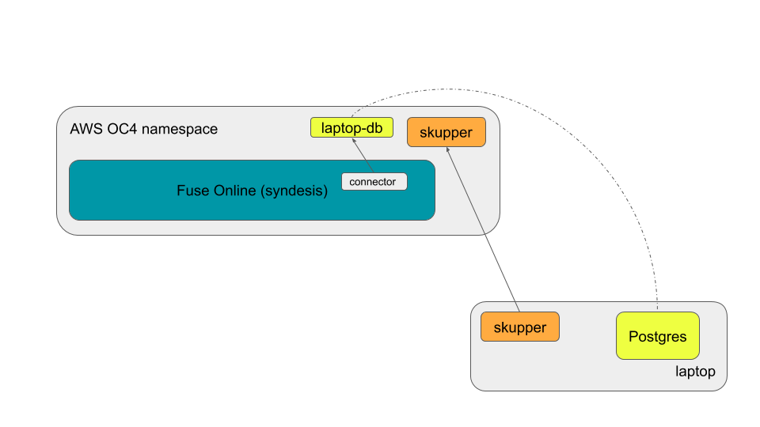

# Commands used in the Skupper/Fuse-Online demonstration

Please see the video at:    https://youtu.be/Wbrk9p79OJM  !


In this demonstration, there are two environments:

* OpenShift on AWS with FuseOnline installed from OperatorHub
* A laptop with Docker installed and running



## Setting up the Virtual Application Network

The VAN in this demonstration is a simple two-node network, one in the FuseOnline namespace running at AWS and the other running on the laptop in a private network.

We begin by installing Skupper in AWS and creating a connection token.

```
[AWS/us-east]$ skupper init
[AWS/us-east]$ skupper connection-token ~/aws.yaml
```

On the laptop, we then install Skupper (using skupper-docker) and use the AWS connection token to make a secure connection to the AWS namespace.

```
[laptop]$ skupper-docker init
[laptop]$ skupper-docker connect ~/aws.yaml
```

On the laptop, we then expose the Postgresql service into the VAN using the address `laptop-db`

```
[laptop]$ skupper-docker expose host-service --address laptop-db --port 5432
```

Once this is done, we can validate that the service has been exposed in AWS by seeing a new service called 'laptop-db'

```
[AWS/us-east]$ oc get services
```

We now need to configure Postgres to allow remote connections from the VAN.  The address that will be used can be determined by using the `list-exposed` command.

```
[laptop]$ skupper-docker list-exposed
```

Note the IP address of the exposed service `laptop-db`

This subnet can be added as a trusted host in Postgres' `pg_hba.conf` file.

```
[laptop]$ sudo vi /var/lib/pgsql/data/pg_hba.conf
# Go to the section "IPv4 local connections" and add a
# line that says: 
#      host all all YOUR.NET.0.0/16   trust
```

The service should then be restarted.

```
[laptop]$ sudo systemctl restart postgresql.service
```

At this time, a connector to the database should be able to be created and validated from Fuse Online.


